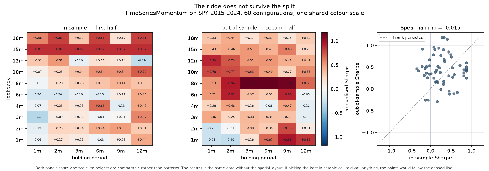
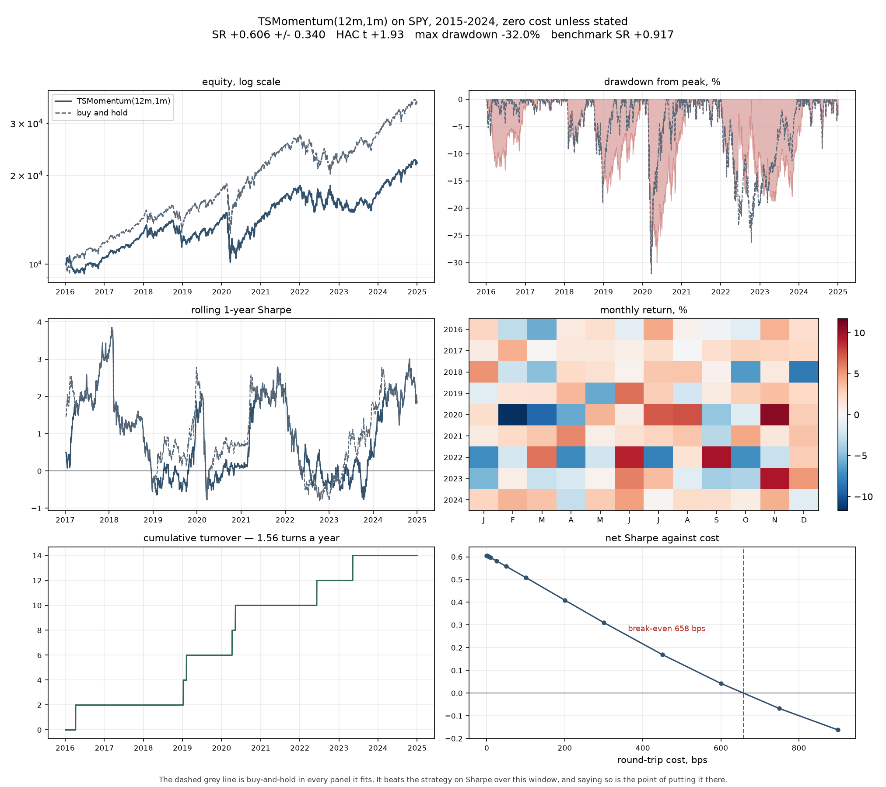
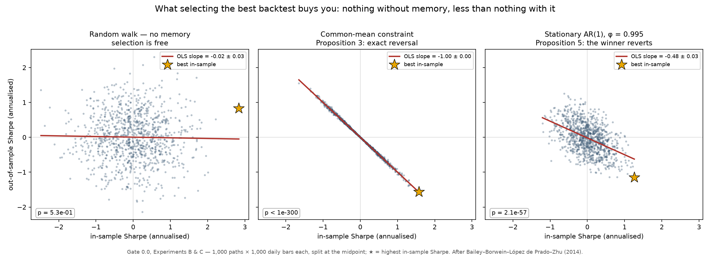
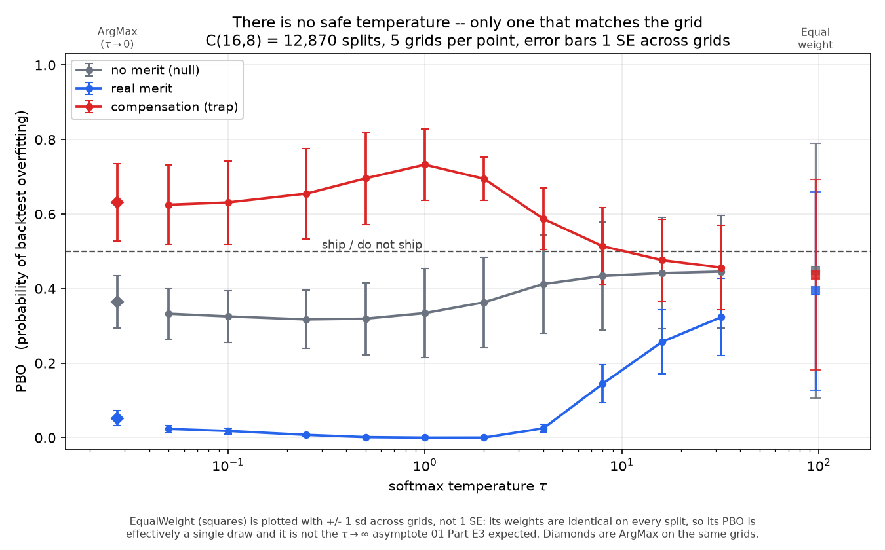

# falsify

A backtesting engine that reports an estimate, **its error bar**, and the probability the
number survived the search that produced it.

It was built to be capable of returning a negative answer about its own strategy. It does.

---

## What this is

Most backtesters answer *"what would this strategy have returned?"* That question has a
number for an answer, and the number is nearly always too high — because it is the best of
however many variants were tried, and almost nobody writes down how many they tried.

falsify answers a different question: **is this number distinguishable from what searching
would have produced anyway?** Every part of the engine exists to make that question
answerable, which means the pipeline is built to fail and to report the failure rather than
to produce a curve that goes up.

You hand it a price series and a strategy that emits target weights. It hands back an equity
curve, an annualised Sharpe **with a confidence interval**, a Newey–West *t*-statistic that
does not pretend your returns are independent, the number of configurations the search
actually evaluated, that Sharpe deflated by that number, the probability of backtest
overfitting, and a four-factor decomposition saying how much of the return was exposure a
reader could have bought for a few basis points. Then two booleans, `interpretable` and
`ships`. For the strategy this repository ships with, both are `false`, and the README leads
with that rather than burying it.

### How you would use it

1. **Write a strategy.** Subclass `Strategy` and return a target weight in [−1, 1] per bar —
   not orders, not trades. Declare its `lookback` rather than letting the engine infer one.
   Sizing, cost accounting and compounding are the engine's job, and keeping them out of
   strategy code is what makes two strategies comparable at all.
2. **Run it against a benchmark on the same window.** `BuyAndHold` is the thing a reader
   could have bought instead. Warm-up is sliced before anything compounds, so both curves
   start from the same base by construction rather than by care.
3. **Sweep the parameters you were going to sweep anyway** — and let the ledger count them.
   Every engine invocation is recorded whether or not you meant it as a trial, so `N` is what
   you actually did, not what you remember doing.
4. **Read the verdict, not the Sharpe.** If the deflated Sharpe is ≈ 0 and PBO is above 0.5,
   the headline number is selection. That is the whole point of the machine, and it is the
   answer it returns about its own strategy.

**What it is not.** It is not a live trading system, an order router, or a portfolio
optimiser. There is no broker integration and there will not be one. It sizes positions as
weights and stops at the point where a real desk would begin — which is deliberate, because
the failure it exists to catch happens well before execution.

---

## The result

`TimeSeriesMomentum(12m, 1m)` on SPY, 2015–2024, zero cost:

| | strategy | buy-and-hold |
|---|---|---|
| annualised Sharpe | **+0.606 ± 0.340** | **+0.923** |
| Newey–West *t* | +1.926 | **+2.924** |
| bootstrap 95% CI | [+0.042, +1.288] | — |
| max drawdown | −32.05% | −32.05% |
| **four-factor alpha** | **−0.02 %/yr, *t* = −0.005** | — |
| deflated Sharpe (N = 24) | **0.000** | — |
| PBO over 252 splits | **0.821** | — |

**The engine does not recommend trading it.** The +0.606 is fully explained by two
exposures the regression names — **+0.618 on the market** and **+0.244 on momentum** — both
of which a reader can buy for a few basis points. Price them and nothing remains. The
benchmark beat it, with the same maximum drawdown on the same day.

Seven independent parts of the machinery reach that verdict, and none was tuned to agree
with the others.

→ **[The full write-up is in `docs/research-note.md`](docs/research-note.md)** — motivation,
data and biases, the causality argument, cost model, results with intervals, deflation,
factor attribution, limitations, and what would have to be true for this to be tradeable.

---

## Quickstart

Python **3.12** and [uv](https://docs.astral.sh/uv/). Steps 1–4 make no network call and
need no data files — everything runs in a clean checkout.

**1. Clone the repository**

```bash
git clone https://github.com/bredy00/falsify.git
cd falsify
```

**2. Install the locked environment**

```bash
uv sync --all-groups
```

**3. Run the gate suite**

```bash
uv run pytest -n auto -m "not live"
```

**475 tests, 0 skipped.** This is the argument, not a smoke test: the causality τ-test,
twin-engine agreement, null calibration, PBO via CSCV, and byte-level reproducibility all
run here. CI averages **49.3 s ± 1.9 (SE)** for lint, typecheck and gates together.

**4. Write the metrics report**

```bash
uv run python scripts/report.py
```

Writes `outputs/metrics.json` — the estimate, its 95% interval, the trial count, the
deflated Sharpe, and two booleans the rest of the file has to earn:

```json
"interpretable": false,
"ships": false
```

Run it twice; the bytes are identical. Note this one runs on **synthetic GBM**, which is
momentum's null, so it works with no cache — it is deliberately not the headline number.

**5. For the real-data figures, populate the cache**

```bash
uv run --group data python scripts/fetch_data.py
```

The only script in the repository that touches the network. It writes parquet under
`data/cache/` and records what it asked for in a committed manifest, which every later read
verifies. Then `make tearsheet` and `make surface` regenerate the two figures below, and
`uv run pytest tests/live -m live` runs the 20 tests that check the headline against real SPY.

### Every other entry point

| | |
|---|---|
| `make ci` | lint + typecheck + gates, exactly as CI runs them |
| `make prop` | Gate 0.0 with printed statistics and its figure |
| `make reproduce` | assert two runs are byte-identical |
| `make report-pdf` | the project board as a PDF |
| `make g9-figure` | PBO against selection temperature at all 12,870 splits — minutes, not seconds |
| `make clean` | drop caches and `outputs/` |

`make help` lists them all. Every target is what CI invokes, so a green `make ci` locally
means a green build.

---

## Core machinery

- **Twin engines, and they must agree.** An explicit event loop and a vectorised
  implementation run the same strategy independently. The slow one is obviously right;
  agreement is what certifies the fast one. Measured difference: **`0.000e+00`** — exact,
  not merely inside tolerance.
- **Causality is a test, not a comment.** Scramble every bar after *t*, re-run, assert the
  output up to *t* is bitwise identical. A `.shift(1)` is a claim; the τ-test is the proof.
- **Every number carries an error bar.** Sharpe with its standard error, Newey–West HAC
  *t*-statistics with automatic lag selection, and stationary-bootstrap confidence intervals
  (Politis–Romano). A point estimate with no interval does not reach the reporting layer.
- **The search is counted by machine.** An append-only trials ledger records every engine
  invocation under a content-addressed id, so the number of configurations tried is read off
  the ledger rather than asserted by a human who might round it down.
- **Overfitting is measured, not assumed.** Combinatorially symmetric cross-validation gives
  the probability of backtest overfitting; the Deflated Sharpe Ratio prices the search that
  produced the number. Both are reported whatever they say — here, **0.821** and **0.000**.
- **Attribution before celebration.** Carhart four-factor regression with HAC standard
  errors, so a return that is really market beta plus momentum gets named as such.
- **Costs are swept, not assumed.** Net Sharpe across a cost grid, reporting the break-even
  round-trip cost — 658 bps for the chosen strategy, which is the holding period earning
  its keep.
- **Determinism is a gate, not a hope.** Seeds are threaded explicitly through every
  stochastic path; two runs from a clean checkout produce byte-identical figures and
  `metrics.json`.
- **Real prices, verified on every read.** Daily bars from Yahoo Finance via `yfinance`,
  cached as parquet and checked against a committed manifest. The gate suite never touches
  the network, by invariant and by test.

### Engine properties

| | |
|---|---|
| **Strategies emit weights** | A target weight in [−1, 1] per bar. Orders, fills and cost accounting belong to the engine (B4). A strategy that emits orders cannot be run through both engines, so it cannot be certified. |
| **Lookback is declared, not inferred** | The event engine slices exactly the bars a strategy says it needs. One that silently reads further back produces NaN and fails loudly. |
| **Frozen results** | `Bars`, `Result` and the cost model are frozen dataclasses (B7). There is exactly one state to compare, which is what makes the twin-engine check mean anything. |
| **Per-observation internally, annualised at the edge** | Sharpe, its standard error and the HAC correction are computed per bar; the ×√252 happens once, at the reporting boundary (B8). |
| **Seeds are arguments, never globals** | Every stochastic path takes an explicit `np.random.Generator` (B9). This is why two runs are byte-identical rather than merely close. |
| **Warm-up is sliced, not compounded** | `equity[0] == initial_capital` exactly, so a benchmark over the same window starts from the same number. |
| **No `bfill`, anywhere** | Backward-filling an interior gap carries a future price into the past. A gap stays NaN and `Bars` refuses to construct (B6). |

### Execution schemes

When you trade is a parameter, not an assumption — the choice is worth real return, and
leaving it implicit is how a backtest flatters itself. A signal decided at the close of bar
*s*:

| convention | fills at | lag | |
|---|---|---|---|
| `close_to_close` | close of *s* | 1 | optimistic — trades the price it just observed |
| **`next_open`** | open of *s+1* | 2 | **the default.** Realistic, and it costs you |
| `next_close` | close of *s+1* | 2 | conservative — carries the full overnight gap |

Both engines must answer *at what price* and *how many bars later* identically, or G2 fails.

### Cost model

Multiplicative on **traded notional**, not additive on portfolio return. The distinction is
invisible while positions are 0/1 and fully allocated, and wrong the moment vol targeting
arrives:

```python
CostModel(
    commission_bps=...,      # per side
    half_spread_bps=...,     # crossing the book
    slippage_bps=...,        # market impact
    borrow_bps_annual=...,   # the cost of being short
    cash_yield_annual=...,   # what idle cash earns
)
```

That last field exists because a long-or-cash strategy sits in cash roughly half the time.
Crediting it 0% misstates the equity curve and the Sharpe in opposite directions at once.

### Strategies included

Single-asset `Strategy` implementations: `BuyAndHold` · `MACrossover` · `CausalZScore` ·
`TimeSeriesMomentum` · `Flat` · `RandomSign`, the calibrated null the whole null-testing
apparatus rests on. `VolTarget` and `TurnoverBuffer` compose on top of any of them.

Cross-sectional long/short runs through a separate panel API — `run_panel` over N aligned
assets, ranked into a long and a short leg — rather than as a `Strategy`, because a weight
per bar and a weight per asset per bar are different contracts and collapsing them would
make the twin-engine check meaningless.

---

## The two heatmaps



Sharpe over the same 60-configuration grid, first half against second half, on one shared
colour scale. The bright 15-month band on the left is the region a reader's eye reads as
"the good parameters". It is absent on the right.

**Spearman ρ between the surfaces = −0.015.** In-sample rank carries no information about
out-of-sample rank. The in-sample winner, (15m, 1m) at +0.874, earns +0.432 out of sample.

That band has a mundane cause: at a 15-month lookback the signal has **zero flips in the
first half**, because SPY rose continuously from 2016 to 2020. Every holding period produced
an identical constant-long path. The ridge is *being long a market that only went up*.



---

## Contents

| File | Role | Read |
|---|---|---|
| `03-AGENT-HANDOFF.md` | operating manual — invariants B1–B10, resolved decisions, session plan | **first** |
| `02-ENGINE-SPEC.md` | interfaces, equations, causality contract, selection rules | second |
| `00-VALIDATION-FIRST.md` | phase ordering, Gate 0.0 and Gate 0 | third |
| `01-STATS-FOUNDATIONS.md` | the statistical machinery and terminology | fourth |
| `PLAYBOOK.md` | original roadmap — **superseded on ordering** by `00` | fifth |
| `thesis.pdf` | the mathematics, 4 pages | background |
| `companion.pdf` | context and further reading, 7 pages | background |

**Precedence when documents conflict:** `03` > `02` > `00` > `01` > `PLAYBOOK`.

Part H of `03` records five decisions that are already made. Do not re-open them.

---

## The thesis in three lines

1. **Causality is a structural constraint, not a comment.** Scramble the future, assert the past
   is bit-identical. A `.shift(1)` is a claim; the τ-test is the proof.
2. **Two independent engines must agree.** Vectorised code is fast and silently wrong; an explicit
   event loop is slow and obviously right. Agreement to 1e-12 certifies the fast one.
3. **The null must be calibrated.** A thousand coin-flip strategies through the whole pipeline.
   If the machinery doesn't reject ~95% of them, nothing downstream means anything.

---

## Gate 0.0 — the thesis in one image



Left: selecting the best of 1,000 backtests on a memoryless process buys you nothing. Middle and
right: on a process with memory it costs you, and the cost grows with how hard you searched. That
is Propositions 3 and 5 of the source paper, reproduced from a seed on this machine rather than
quoted.

`tests/gates/test_prop.py` — 14 tests, ~12 s, numpy and scipy only, no network, no engine.
Regenerate with `pytest tests/gates/test_prop.py -v -s`.

## Phase 8 — what the tearsheet surfaces

The two figures are at the top; this is what they say that the summary statistics hide.

- **Max drawdown is identical to the benchmark's, −32.05%, troughing the same day.** The
  equity curves differ elsewhere — but through the COVID crash the strategy held weight
  exactly 1.0, because a 12-month signal cannot turn inside a four-week decline. When
  protection would have mattered most, the trend follower *was* buy-and-hold.
- **Break-even cost is 658 bps.** At 1.56 turns a year the strategy is nearly
  cost-insensitive, which is the holding period earning its keep and the one dimension on
  which it clearly beats a daily-rebalanced trend follower. The first cost grid stopped at
  100 bps and returned NaN — correct behaviour, uninformative figure.
- **Both surface panels share one colour scale.** On separate scales the out-of-sample
  noise would look as structured as the in-sample signal — same data, opposite conclusion.

---

## Phase 7 — factor attribution, and where the return actually came from

Carhart four factors from the Ken French library, HAC standard errors, close-to-close,
2015–2024:

| strategy | α /yr | HAC t | R² | Mkt-RF | SMB | HML | UMD |
|---|---|---|---|---|---|---|---|
| BuyAndHold | +0.12% | +0.37 | 0.995 | +0.975 | −0.126 | +0.015 | −0.007 |
| **TSMomentum(12m,1m)** | **−0.02%** | **−0.01** | 0.408 | +0.618 | −0.064 | +0.182 | **+0.244** |
| TSMomentum(12m,3m) | −6.43% | −1.47 | 0.370 | +0.575 | −0.089 | +0.094 | +0.284 |
| XS momentum 12m | −2.51% | −1.29 | 0.520 | +0.006 | +0.032 | −0.020 | **+0.323** |
| XS momentum 1m | −5.50% | −2.49 | 0.056 | −0.048 | −0.015 | −0.023 | +0.065 |

PLAYBOOK asks: *"If your alpha t-stat drops below 2 after controlling for momentum, say so
in the README. That single act of intellectual honesty is worth more to a reader than a
2.5 Sharpe."*

**It does not drop below 2. It drops to zero** — t = −0.01. The +0.606 Sharpe
`TimeSeriesMomentum(12m,1m)` earns on SPY is fully accounted for by two exposures the
regression names: **+0.618 on the market**, because a trend follower is long a rising
index most of the decade, and **+0.244 on UMD**, because it *is* a momentum strategy.
Price both and nothing is left. Not one construction in the zoo produces positive alpha
at |t| > 2.

The buy-and-hold row is the calibration that makes the rest readable: SPY loads 0.975 on
the market at R² 0.995 with no alpha, which is exactly what an index fund should show.

That check earned its keep immediately. Run against the `next_open` convention it gave
**β = 0.367, R² = 0.159** for a market index — because `next_open` measures open-to-open
while the factors are close-to-close, and those correlate 0.40 daily. Every β in the first
table was wrong and nothing else would have flagged it.

**On β = Cov/Var:** the factor loadings *are* that quantity. At one factor,
`fit_factors` reproduces `regression.fit_bivariate`'s `cov/var` to **2.2e-16** — asserted,
not described. The multivariate case generalises it to `(X'X)⁻¹X'r`, which matters
precisely because the factors are correlated: four separate `cov/var` fits would attribute
the same return to several factors at once.

---

## Phase 7 — the long/short spread, and what it costs to be honest

Nine SPDR sector funds, 2015–2024, dollar-neutral tertile long/short, zero cost:

| construction | SR | ±SE | turns/yr | HAC t |
|---|---|---|---|---|
| XS momentum 12m, monthly | −0.065 | 0.334 | 4.79 | −0.20 |
| XS momentum 12m, daily | −0.023 | 0.334 | 23.03 | −0.07 |
| XS momentum 6m, monthly | +0.157 | 0.325 | 6.58 | +0.51 |
| XS momentum 1m, monthly | −0.432 | 0.318 | 16.31 | −1.37 |

**There is no edge here, and that is the result.** Not one construction reaches a HAC
t-statistic near 2. The failure mode would be running a fifth and sixth until one did —
which is the search the trials ledger exists to count.

The gap from Phase 8 is the whole point. `TimeSeriesMomentum(12m,1m)` earned **+0.606** on
SPY; the *same signal*, ranked cross-sectionally and held dollar-neutral, earns **nothing**.
That difference is the market. The time-series version is long a rising index most of the
decade and collects its drift; the cross-sectional version is constrained to zero net
exposure and cannot. The long/short spread is the cleaner place to look for skill, and it
usually has less to show.

The panel engine is a second implementation of Part E, so it is held to G2's standard: at
N = 1 it reproduces `run_vectorized` **bitwise**, max |diff| = 0.000e+00. That check earned
its keep immediately — the first version computed the warm-up as `max(first_nonzero, lag)`
instead of `first_nonzero + lag`, and was wrong by 1,313 on a 10,000 account.

The universe opened under Part H decision 1's own revisit condition. It is nine sector
ETFs rather than nine stocks because yfinance returns currently-listed tickers only, so a
stock universe picked today is survivorship-biased over a 2015 start.

---

## Phase 8 — time-series momentum, against the literature

`PLAYBOOK` Phase 6 calls for Moskowitz–Ooi–Pedersen (2012) as *"a free calibration check
against the literature"*: published Sharpe ≈ 0.8, and **"if yours comes out at 3.0 on SPY,
you have a bug."**

`TimeSeriesMomentum(12m, 1m)` on SPY 2015–2024 earns **+0.606 ± 0.340** annualised, at
1.56 turns a year, Newey–West t = +1.93. That looks like a hit on 0.8 and is not one — the
published figure is 58 futures across four asset classes, and most of it is
diversification a single index cannot reproduce. What the check licenses is the negative:
nothing here is near 3.0, so nothing indicates a bug.

Buy-and-hold earned **+0.830** over the same window and is the only strategy in the zoo
whose HAC t-statistic clears 2. That is stated here rather than buried.

The synthetic pair is the sharper result. Same engine, same costs:

| process | TSMOM annualised Sharpe |
|---|---|
| GBM — no persistence (the null) | −0.141 ± 0.145 |
| persistent drift, ψ = 0.99 | **+1.659 ± 0.262** |
| stationary AR(1) — mean reversion's home ground | **−1.041 ± 0.102** |

A trend follower earns where drift persists and loses, at 10 standard errors, on the exact
process `CausalZScore` exploits. An edge is a property of a process, not of a strategy.

One finding worth the space: building the trending generator by autocorrelating *returns*
does not work. At a daily φ of 0.30 — far beyond any real market — a 12-month signal earns
+0.025 ± 0.109, because φ²⁵² is zero. Momentum is not lag-1 autocorrelation, and a
generator built on that intuition would have failed the strategy while the strategy was
correct.

---

## G9 — the price of selectivity, measured



`01` Part E3 predicts this curve falls monotonically as selection is diluted, with
`EqualWeight` as the asymptote. Measured over the full C(16,8) = 12,870 splits, it does not.
On a grid built so that the in-sample winner is mechanically the out-of-sample loser, PBO
*rises* to a peak of 0.733 at τ = 1 before falling — a mild softmax still concentrates on the
top few in-sample performers, which are exactly the configurations that reverse. On a grid
with real, persistent merit the curve runs the other way, sitting near zero at τ = 1 and
climbing to 0.324 by τ = 32, because diluting selection when the differences are real throws
away the information that made selection worth doing.

The safe temperature is therefore neither 0 nor infinity; it depends on whether the grid has
genuine merit, which is the one thing you cannot know in advance. That is the argument for
measuring PBO rather than assuming a selection rule is safe.

`EqualWeight` cannot be the asymptote in any case: its weights are identical on every split,
so all 12,870 are near perfectly dependent and its PBO is effectively a single draw (sd 0.26
to 0.34 across grids). It is plotted with that spread and excluded from every assertion.

`tests/gates/test_g9_pbo.py` — 16 tests, ~8 s at C(8,4). The null calibrates to 0.5 at every
block count tested (0.4930, 0.4850, 0.4798, 0.4809 at S = 8, 10, 12, 16 over 80 grids each),
which is what makes the 0.5 ship threshold mean anything. Regenerate the figure with
`make g9-figure` — ~25 minutes, or instant from the cached measurements beside it.

| Experiment | Measured | Reference | Verdict |
|---|---|---|---|
| **A** E[max z], N = 1,000, 10,000 reps brute force | 3.2394 ± 0.0035 | 3.241436 exact | 0.58 SE |
| **A** Monte Carlo vs exact, N = 2 … 10⁶ (13 values) | worst gap 1.98 SE | exact quadrature | holds at every N |
| **A** growth vs `√(2 ln N)` | ratio 0.479 → 0.925 | — | approaches the bound from below |
| **B** memoryless slope | −0.019 ± 0.030 (p = 0.53) | 0 | no information in the in-sample number |
| **B** winner's OOS Sharpe, 200 reps | +0.053 ± 0.048 | 0 | selection is free |
| **B** winner's IS Sharpe, 200 reps | 2.321 ± 0.017 | 2.311 (Prop 1) | A predicts B to 0.45% |
| **C** common-mean slope | −0.9989 ± 0.0014 (p < 1e-300) | −1 | the exact reversal of Prop 3 |
| **C** AR(1) φ = 0.995 slope | −0.481 ± 0.028 (p = 2.1e-57) | < 0 | the winner reverts (Prop 5) |

Intercepts are insignificant in both C panels (−0.0000 ± 0.0007 and −0.019 ± 0.012), as the
propositions require: the effect is a rotation, not a level shift.

### The error budget of SR₀

Experiment A separates two things that a single tolerance would conflate. The empirical mean
estimates the **true** `E[max z]`, computed here by quadrature and checked against the closed forms
`1/√π` and `3/(2√π)` to machine precision. The two-term Gumbel expression is only an
*approximation* to that truth — and it is the approximation `01` Part B3 feeds into the Deflated
Sharpe as the benchmark SR₀, so its error is a bias in the DSR itself:

| N | 2 | 3 | 5 | 10 | 50 | 100 | 1,000 | 10⁶ |
|---|---|---|---|---|---|---|---|---|
| error in SR₀ | −7.88% | +0.77% | +2.55% | +2.33% | +1.21% | +0.92% | +0.42% | +0.10% |

The sign matters: the formula **overstates for every N ≥ 3**, so SR₀ is too strict rather than too
lax and the resulting DSR is conservative. Below N = 100 the error exceeds 1% and should be quoted
alongside any DSR computed there. At the N this project reports — hundreds of configurations — it is
about half a percent. All of this is asserted, not assumed.

Four negative controls ship alongside, because a gate that cannot fail is not a gate (`03` F7). One
holds the seed and the estimator fixed and shows the slope moving from +0.029 ± 0.031 to
−0.997 ± 0.001 under recentring alone, so the effect is the treatment and not the machinery. Another
shows that at 200,000 repetitions the exact reference sits 0.54 SE from the empirical mean while the
Gumbel approximation sits 16.88 SE away — which is why Experiment A is judged against exact
quadrature and not against the formula.

Numeric output and the figure's bytes are identical across two runs at the same seed.

---

## Gate status — all ten green

**475 tests, 0 skipped**, entirely offline, plus **20 live tests** against the pinned
cache. `make ci` runs exactly what CI runs.

**Timings carry error bars, including this project's own.** Over 14 successful runs CI
averages **49.3 s ± 1.9 (SE)**, with a standard deviation of 7.2 s — 14.7% of the mean,
range 35–59 s. So a difference smaller than about 14 s between two single runs is not
evidence of anything, and earlier single-run figures quoted here (40 s, 47 s) were lucky
draws rather than measurements. Regenerate with
`uv run python scripts/ci_timing_study.py`.

| Gate | Statement | Status |
|---|---|---|
| **0.0** | Reproduce the propositions before building anything | **green** — see above |
| **G1** | Causality: scramble the future, the past stays bit-identical | **green** — 500 cuts × 20 seeds per strategy |
| **G2** | Twin engines agree to 1e-12 | **green** — `0.000e+00`, exact |
| **G3** | Analytic recovery on synthetic GBM | **green** — two Sharpe conventions, vol, drift |
| **G4** | Zero-cost identity | **green** — bitwise, both engines, all conventions |
| **G5** | Cost monotonicity, break-even cost | **green** — c\* = 27.03 bps per turn |
| **G6** | Null calibration, 1,000 coin flips | **green** — turnover matched to 0.35%, verified in 15 worlds |
| **G7** | Leakage trap: deliberately leaky pipelines must be caught | **green** — 5 traps rejected |
| **G8** | Purged, embargoed walk-forward | **green** — 3 splitters, purge + embargo asserted |
| **G9** | PBO via CSCV over 12,870 splits, on `SelectionRule` | **green** — null calibrates to 0.5, fires on a compensation trap at 0.83 |
| **G10** | Reproducibility from pinned hashes | **green** — two runs byte-identical across three figures and `metrics.json` |

Ten invariants (`B1`–`B10`) hold alongside them, including the append-only trials ledger
from which `N` is read and never typed.

Everything through G8 runs with no network, no API key and no rate limit. That is the whole point of
the ordering in `00`: the certified core is testable in CI without a single flaky test that fails
because Yahoo timed out.

### G2 came out exact, not merely within tolerance

The two engines are written independently — the event engine loops bar by bar over hard-sliced
prefixes, the vectorised one uses whole-series rolling operations and array arithmetic — and they
share nothing but the warm-up index. Agreement is bitwise across the strategy zoo, all three
execution conventions, and a cost sweep to 125 bps. A planted one-bar engine disagreement is caught
at `7.4e-02`, so the gate discriminates rather than passing vacuously.

The three conventions are genuinely distinct on the same series: `close_to_close` 12924.37,
`next_open` 12915.83, `next_close` 11688.41. That spread is execution-assumption risk.

### G3 recovers known truth, in both directions

| Quantity | Measured (200 paths) | True value | Gap |
|---|---|---|---|
| Simple-return Sharpe | +0.37513 ± 0.02358 | `μ/σ` = 0.40 | 1.05 SE |
| Log-return Sharpe | +0.27461 ± 0.02364 | `(μ−σ²/2)/σ` = 0.30 | 1.07 SE |
| Annualised vol | 0.20018 ± 0.00020 | `σ` = 0.20 | 0.09% rel |
| Annualised log drift | +0.05502 ± 0.00474 | `μ−σ²/2` = 0.06 | 1.05 SE |

**Both Sharpe conventions are asserted, and that is deliberate.** `00` Gate 0.1 states the true
Sharpe is 0.30 and warns that 0.40 means you used `μ` instead of `μ−σ²/2`. Both numbers are right,
for different estimators: the Sharpe of *log* returns is 0.30, the Sharpe of *simple* returns is
`μ/σ` = 0.40, because `E[exp(g)−1] = μ/252` exactly. Part E's equity recursion compounds simple
returns, so the engine measures 0.40 and is correct to — asserting 0.30 against it would reject a
working engine. Pinning both means confusing them fails one direction or the other, which is what
the gate was reaching for.

Two companions ship with it. The Monte Carlo standard error falls with a log-log slope of
**−0.5173** (r² = 0.997), confirming `1/√M` — that is the *estimator* error, reducible by
simulation, and not the estimate error, which shrinks only with history. And the power test:
mean reversion earns **+0.0051 ± 0.0738 on GBM** but **+1.1534 ± 0.0703 on a stationary AR(1)**.
The first says the engine invents no edge; the second says it does not destroy edge that exists,
which no real-data test can establish because there "found nothing" is always a plausible answer.

### G5 — the number that matters

Break-even cost **c\* = 27.03 bps per turn**, verified to separate profit from loss: +0.35 Sharpe at
half of c\*, −0.35 at 1.5×. Net Sharpe is monotone non-increasing across 0–100 bps, and
buy-and-hold's Sharpe moves by exactly `0.000e+00` across the whole sweep, which confirms cost is
charged on traded notional rather than on portfolio return. Faster rules die sooner: at 135 turns a
year the strategy is unprofitable even for free, at 49 turns it survives to 78 bps.

### G6 — the null, and the result that matters

A thousand coin flips through the entire pipeline, matched to the strategy's realised
**turnover and exposure**, both read off its own engine run. Turnover matching is the whole job:
a naive coin flip trades 249.7 times a year and earns −1.081 at 20 bps, while the matched null
trades 72.5 times and earns −0.477. Compare a strategy against the naive null and it clears the
bar trivially, for entirely the wrong reason.

**The headline, and it is the honest kind:**

| `CausalZScore(20)` | Sharpe | empirical p vs its own null |
|---|---|---|
| gross (0 bps) | +1.0566 | **0.0110** |
| net (20 bps) | +0.4853 | **0.1628** |

The edge is real against noise and **does not survive realistic costs** at the 5% level. Across
15 independent worlds the pattern holds: mean p = 0.029 gross, **0.172 net**.

The machinery is calibrated too. Under a true null PSR(0) is approximately uniform, and the
rejection rate at α must be about α — measured 0.085 / 0.040 against nominal 0.10 / 0.05. DSR
rejects all 1,000; the luckiest coin flip of a thousand reaches 0.18.

**Bounds set by a 15-world replication study** (`scripts/g6_replication.py`), not by one run —
and the study earned its keep. It showed the gate as first written **would have failed**: the
`< 3 SE` bounds hit 4.08 SE and 3.27 SE in some worlds. The cause was a statistical error in the
bound rather than in the null — the 1,000 nulls all trade one price path, so they are not
independent draws and the naive/binomial SE understates the true uncertainty. The bounds are now
scale-free or evidence-based, and the study verifies them: **15/15 worlds pass**. The 1% level is
reported but not asserted, because 1,000 draws cannot resolve a 1% tail — 10 expected exceedances
carries Poisson noise of ±3, and the worlds duly spread 0.003 to 0.020.

### The propagation layer

G5 showed turnover was doing more damage than the signal was doing good, with no dial to turn.
Two composable overlays now provide one. On `CausalZScore(20)`:

| | turnover/yr | gross SR | net SR @ 20 bps |
|---|---|---|---|
| base | 74.32 | +0.9464 | +0.3864 |
| `VolTarget` + `TurnoverBuffer` | **24.74** | +1.1176 | **+0.7076** |

Turnover −67%, net Sharpe **+83%**, while the gross Sharpe barely moves — which is what shows the
gain came from paying less transaction tax rather than from a different signal. G1's strict cut
caught a real bug on the way: `VolTarget` first sized on same-bar volatility while the base signal
was lagged a bar, setting the position from an information set the signal itself was not allowed
to use. It passed the Part A1 causality contract and failed execution alignment — precisely the
distinction the two cut modes exist to separate.

### G8 — walk-forward, and the integration layer

The gate's condition is blunt: **zero index overlap, asserted in code, not in docs.**
`Split` refuses to construct when train and test intersect, so a leaking partition is
*unconstructable* rather than caught later inside a Sharpe.

Three geometries, because "walk-forward" is not one thing. `ExpandingWindow` anchors at
bar 0 and grows — how a strategy is actually run. `RollingWindow` holds the training
length fixed, making folds comparable and deliberately forgetting the distant past.
`PurgedKFold` trains on both sides of the block: explicitly **not** a walk-forward, kept
because it is the geometry CSCV needs at G9 and the only one where the embargo does any
work. Purge and embargo are tested separately, because transposing them yields folds
that are non-overlapping, plausible and wrong.

The integration layer is the other half: `build_grid` pushes a configuration grid
through the certified engine, `walk_forward_select` splits it, selects on each training
block with a `SelectionRule`, and scores only out of sample. Built here rather than at
G9 on purpose — CSCV needs exactly a `(T, N)` grid, a block splitter and a rule, so G9
assembles certified parts instead of inventing them beside its own rank bookkeeping.

**Three assertions were written, measured, and then rewritten.** That is the substance:

*Draft one* asserted ArgMax degrades out of sample. It failed with OOS **above** IS
(+1.98 vs +1.19) — failure mode F6, which reads as a leak. It was not one: every fold
showed a purge gap of exactly 10 with train strictly before test. Over 20 seeds,
degradation is **−0.041 ± 0.125**, negative in 10 of 20. An 80-bar Sharpe carries an SE
near 1.77, so a six-fold mean carries 0.72 — the assertion was on noise. Replaced by the
exact structural claim (ArgMax's IS Sharpe *equals* the grid maximum, 20/20), with
degradation reported rather than gated.

*Draft two* expected the compensation effect — a negative IS→OOS slope. It measured
**+0.979 ± 0.085, positive in 20/20**, and that is correct rather than broken:

| Process | IS→OOS slope over 20 seeds | reading |
|---|---|---|
| AR(1), configs genuinely differ | **+0.979 ± 0.085**, >0 in 20/20 | ranking carries real information |
| GBM, no config has an edge | +0.215 ± 0.265, <0 in 8/20 | indistinguishable from zero |

A negative slope is the signature of selecting among configurations with **no true
differential merit**. On a stationary mean-reverting series where slow z-scores earn a
real edge and trend-followers genuinely lose, in-sample ranking *should* predict
out-of-sample. The compensation effect belongs to the memoryless case. So the slope is
reported, not gated — one GBM path puts it anywhere from −1.78 to +2.26 — and what is
asserted is what survives: a real edge survives the walk-forward, and none is
manufactured on GBM.

*Draft three* asserted all three splitters raise on 20 observations. `PurgedKFold` does
not, and should not — 20 observations is a perfectly legal 5-fold split.

### Suite performance

| | before | after |
|---|---|---|
| tests | 225 | **263** |
| skipped | 4 | **0** |
| local runtime | 49.8 s | **28 s** |
| CI total | 55 s | **47 s** (gate step 27 s) |

`pytest-xdist` at `-n auto` does the work, with **every test still at full strength** —
G1 keeps its spec-mandated 500 cuts × 20 seeds. The 4 skips were `TopK(3)` receiving a
grid narrower than 3 columns; N is now drawn `>= k` so every example exercises the rule.
A skip conditioned on a random draw is worse than a skip, because how much of the
property got checked varied run to run.

One thing parallelising broke and had to be fixed: **the collection floor stopped
working under xdist**, raising `UsageError` inside a worker where pytest surfaces it as
an `INTERNALERROR`. A countermeasure that evaporates the moment you change how tests run
is worse than none, so it now enforces controller-side and is verified firing in both
serial and parallel.

### The A4 ruling

`02` Part A4 asserts G1 must catch `LeakyOracle` — `sign(diff(close))` — and that a silent harness
is broken. **Ruled 2026-08-08: A1 stands, and the trap was mis-specified.** `close[t]` lies inside
`bars[0:t+1]`, which A1 permits, and every Part D convention lags the weight at least one bar, so
that strategy never trades on information it could not have had. Measured through the engine it
earns **+0.054** annualised Sharpe against buy-and-hold's +0.372; a strategy that genuinely sees one
bar ahead earns **+21.10**. Tightening A1 would have failed every legitimate `close_to_close`
strategy while catching nothing real. G7 now traps a true look-ahead oracle, and the A4 strategy is
kept as a documented non-violator so the reasoning is not lost.

---

## The number to hold onto

800 configurations, four years of daily data, pure noise: expected best annualised Sharpe ≈ **1.6**.
Report 1.4 on that grid and you underperformed randomness.

---

## Source

Bailey, Borwein, López de Prado & Zhu (2014), *Notices of the AMS* 61(5), 458–471.
Open access: https://www.ams.org/notices/201405/rnoti-p458.pdf

The two PDFs here are original exposition written to accompany that paper. They reproduce none
of it. Read the original.
